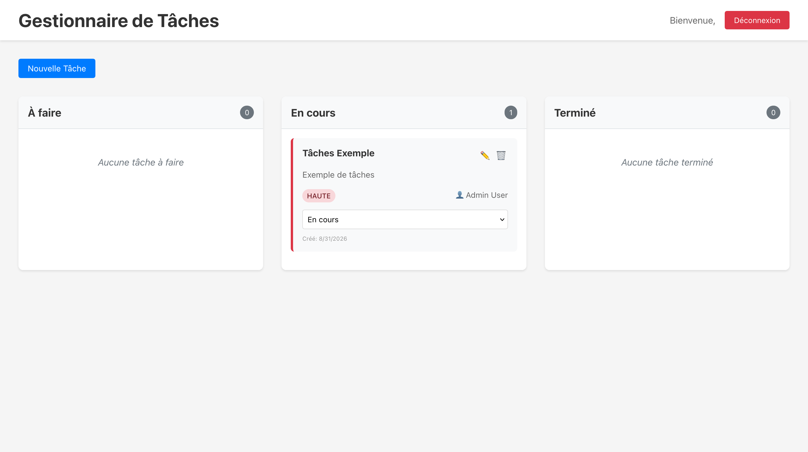
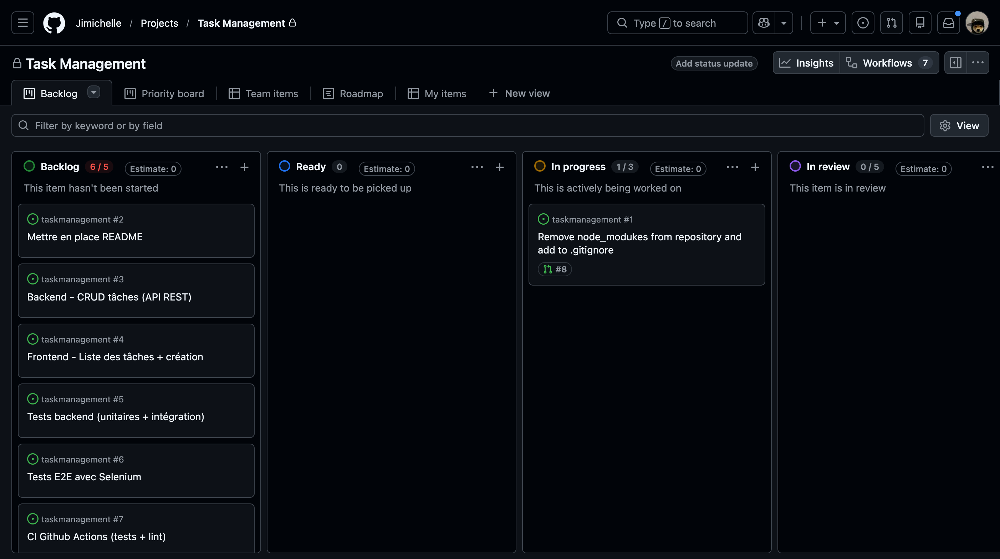

# Task Management

**Application de gestion de tâches**



## Participants

**FALL Ndeye Fatima**  
**CHAUDEMANCHE Mathis**  
**DENYSIAK Jimi**  

## Structure

```
taskmanagement/
├── .gitignore
├── LICENSE
├── README.md
├── backend/
│   ├── package.json
│   └── server.js
├── frontend/
│   ├── index.html
│   ├── package.json
│   ├── package.json.backup
│   ├── public/
│   │   └── manifest.json
│   ├── src/
│   │   ├── App.css
│   │   ├── App.js
│   │   ├── components/
│   │   │   ├── Dashboard.js
│   │   │   ├── Login.js
│   │   │   ├── PrivateRoute.js
│   │   │   ├── Register.js
│   │   │   ├── TaskCard.js
│   │   │   ├── TaskForm.js
│   │   │   └── TaskList.js
│   │   ├── contexts/
│   │   │   ├── AuthContext.js
│   │   │   └── TaskContext.js
│   │   ├── index.css
│   │   ├── index.js
│   │   └── setupTests.js
│   └── vite.config.js
└── projet_gestionnaire_taches_examen.md

```
## Requis

- Node.js >= 22
- npm >= 11

*Requis approximatifs*

## Installations & Lancement

### Front-End

**Installation**

```shell
cd frontend # Déplacement vers le répertoire de travail

npm install # Installation des dépendances
```

**Lancement**

```shell
npm run dev # Lancement du serveur de développement

npm run build # Compilation du projet

npm run start # Lancement du projet compilé

npm run preview # Prévisualisation du projet compilé

npm run test # Test unitaire
```

### Back-End

**Installation**

```shell
cd backend # Déplacement vers le répertoire de travail

npm install # Installation des dépendances
```

**Lancement**

```shell
npm start # Lancement du serveur de production

npm dev # Lancement du seerveur de développement

npm test # Test unitaire

npm lint # Analyse de code
```

## Tests

Le projet est testé sur trois niveaux : des tests unitaires sur le back-end (Jest + Supertest), des tests unitaires sur le front-end (Vitest) et des tests end-to-end avec Selenium qui rejouent les parcours utilisateurs dans un vrai navigateur Chrome.

```shell
cd backend && npm test # Tests unitaires du back-end

cd frontend && npm run test # Tests unitaires du front-end

cd tests && npm test # Tests end-to-end (front et back doivent être lancés)
```

*Pour les tests end-to-end, Chrome doit être installé sur la machine*

## Workflows & Lintage

Le code est analysé avec ESLint sur les deux parties du projet. L'analyse peut être lancée en local, avec une correction automatique si besoin.

```shell
npm run lint # Analyse du code (backend ou frontend)

npm run lint:fix # Analyse et correction automatique
```

Deux workflows GitHub Actions tournent à chaque push et à chaque pull request : `lint.yml` qui lance ESLint sur le back-end et le front-end en parallèle, et `docker.yml` qui vérifie que les deux images Docker se construisent correctement. Si un workflow échoue, la pull request ne doit pas être mergée !

## Comment participer ?

### Code of Conduct
1 - Faire un fork du projet  
2 - Ouvrir une issue sur github  
3 - Ouvrir une nouvelle branche avec ce format : `issues/issue-self-explanatory-name`  
4 - Faire vos modifications  
5 - Faire un pull request  
6 - Attendre la validation  
7 - Faire un merge  
8 - Félicitations votre code est sur le projet !  

### Project Roadmap

Vous pouvez [consulter](https://github.com/users/Jimichelle/projects/6) la roadmap du projet pour suivre l'avancement des fonctionnalités et des tâches à réaliser.

